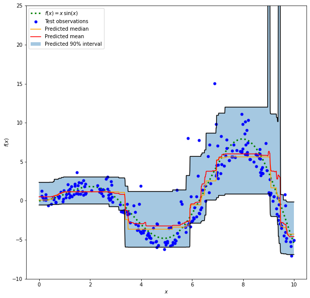

None

.. note:: This tutorial was generated from an IPython notebook that can be
          downloaded `here <../../../source/notebooks/example_qrf.ipynb>`_.

.. _example_qrf:

Prediction Intervals for Quantile Regression Forests
====================================================

This example shows how quantile regression can be used to create
prediction intervals. Note that this is an adapted example from Gradient
Boosting regression with quantile loss. The procedure and conclusions
remain almost exactly the same.

Generate some data for a synthetic regression problem by applying the
function f to uniformly sampled random inputs.

.. code:: python

    import numpy as np
    from sklearn.model_selection import train_test_split

.. code:: python

    def f(x):
        """The function to predict."""
        return x * np.sin(x)
    
    
    rng = np.random.RandomState(42)
    X = np.atleast_2d(rng.uniform(0, 10.0, size=1000)).T
    expected_y = f(X).ravel()

To make the problem interesting, we generate observations of the target
y as the sum of a deterministic term computed by the function f and a
random noise term that follows a centered
``log-normal <https://en.wikipedia.org/wiki/Log-normal_distribution>``\ \_.
To make this even more interesting we consider the case where the
amplitude of the noise depends on the input variable x (heteroscedastic
noise).

The lognormal distribution is non-symmetric and long tailed: observing
large outliers is likely but it is impossible to observe small outliers.

.. code:: python

    sigma = 0.5 + X.ravel() / 10
    noise = rng.lognormal(sigma=sigma) - np.exp(sigma ** 2 / 2)
    y = expected_y + noise

Split into train, test datasets:

.. code:: python

    X_train, X_test, y_train, y_test = train_test_split(X, y, random_state=0)

Fitting non-linear quantile and least squares regressors
--------------------------------------------------------

Fit a Random Forest Regressor and Quantile Regression Forest based on
the same parameterisation.

.. code:: python

    from sklearn_quantile import RandomForestQuantileRegressor
    from sklearn.ensemble import RandomForestRegressor
    from sklearn.metrics import mean_pinball_loss, mean_squared_error

.. code:: python

    common_params = dict(
        max_depth=3,
        min_samples_leaf=4,
        min_samples_split=4,
    )
    qrf = RandomForestQuantileRegressor(**common_params, q=[0.05, 0.5, 0.95])
    qrf.fit(X_train, y_train)

.. parsed-literal::

    RandomForestQuantileRegressor(max_depth=3, min_samples_leaf=4,
                                  min_samples_split=4, q=[0.05, 0.5, 0.95])

For the sake of comparison, also fit a standard Regression Forest

.. code:: python

    rf = RandomForestRegressor(**common_params)
    rf.fit(X_train, y_train)

.. parsed-literal::

    RandomForestRegressor(max_depth=3, min_samples_leaf=4, min_samples_split=4)

Create an evenly spaced evaluation set of input values spanning the [0,
10] range.

.. code:: python

    xx = np.atleast_2d(np.linspace(0, 10, 1000)).T

All quantile predictions are done simultaneously.

.. code:: python

    predictions = qrf.predict(xx)

Plot the true conditional mean function f, the prediction of the
conditional mean (least squares loss), the conditional median and the
conditional 90% interval (from 5th to 95th conditional percentiles).

.. code:: python

    import matplotlib.pyplot as plt
    
    y_pred = rf.predict(xx)
    y_lower = predictions[0]
    y_med = predictions[1]
    y_upper = predictions[2]
    
    fig = plt.figure(figsize=(10, 10))
    plt.plot(xx, f(xx), 'g:', linewidth=3, label=r'$f(x) = x\,\sin(x)$')
    plt.plot(X_test, y_test, 'b.', markersize=10, label='Test observations')
    plt.plot(xx, y_med, 'r-', label='Predicted median', color="orange")
    plt.plot(xx, y_pred, 'r-', label='Predicted mean')
    plt.plot(xx, y_upper, 'k-')
    plt.plot(xx, y_lower, 'k-')
    plt.fill_between(xx.ravel(), y_lower, y_upper, alpha=0.4,
                     label='Predicted 90% interval')
    plt.xlabel('$x$')
    plt.ylabel('$f(x)$')
    plt.ylim(-10, 25)
    plt.legend(loc='upper left')
    plt.show()

.. parsed-literal::

    /var/folders/dl/b3rz1nb55sqgldl8hnzqvz0m0000gn/T/ipykernel_38586/1410534679.py:11: UserWarning: color is redundantly defined by the 'color' keyword argument and the fmt string "r-" (-> color='r'). The keyword argument will take precedence.
      plt.plot(xx, y_med, 'r-', label='Predicted median', color="orange")

Comparing the predicted median with the predicted mean, we note that the
median is on average below the mean as the noise is skewed towards high
values (large outliers). The median estimate also seems to be smoother
because of its natural robustness to outliers.

Analysis of the error metrics
-----------------------------

Measure the models with :func:``sklearn.mean_squared_error`` and
:func:``sklearn.mean_pinball_loss`` metrics on the training dataset.

.. code:: python

    import pandas as pd
    
    def highlight_min(x):
        x_min = x.min()
        return ['font-weight: bold' if v == x_min else ''
                for v in x]
    
    
    results = []
    for i, model in enumerate(["q 0.05", "q 0.5", "q 0.95", "rf"]):
        metrics = {'model': model}
        if model == "rf":
            y_pred = rf.predict(X_train)
        else:
            y_pred = qrf.predict(X_train)[i]
        for alpha in [0.05, 0.5, 0.95]:
            metrics["pbl=%1.2f" % alpha] = mean_pinball_loss(
                y_train, y_pred, alpha=alpha)
        metrics['MSE'] = mean_squared_error(y_train, y_pred)
        results.append(metrics)
    
    pd.DataFrame(results).set_index('model').style.apply(highlight_min)

.. raw:: html

    
    <table id="T_a596e">
      <thead>
        <tr>
          <th class="blank level0" >&nbsp;</th>
          <th id="T_a596e_level0_col0" class="col_heading level0 col0" >pbl=0.05</th>
          <th id="T_a596e_level0_col1" class="col_heading level0 col1" >pbl=0.50</th>
          <th id="T_a596e_level0_col2" class="col_heading level0 col2" >pbl=0.95</th>
          <th id="T_a596e_level0_col3" class="col_heading level0 col3" >MSE</th>
        </tr>
        <tr>
          <th class="index_name level0" >model</th>
          <th class="blank col0" >&nbsp;</th>
          <th class="blank col1" >&nbsp;</th>
          <th class="blank col2" >&nbsp;</th>
          <th class="blank col3" >&nbsp;</th>
        </tr>
      </thead>
      <tbody>
        <tr>
          <th id="T_a596e_level0_row0" class="row_heading level0 row0" >q 0.05</th>
          <td id="T_a596e_row0_col0" class="data row0 col0" >0.155918</td>
          <td id="T_a596e_row0_col1" class="data row0 col1" >1.524603</td>
          <td id="T_a596e_row0_col2" class="data row0 col2" >2.893288</td>
          <td id="T_a596e_row0_col3" class="data row0 col3" >21.433560</td>
        </tr>
        <tr>
          <th id="T_a596e_level0_row1" class="row_heading level0 row1" >q 0.5</th>
          <td id="T_a596e_row1_col0" class="data row1 col0" >0.571557</td>
          <td id="T_a596e_row1_col1" class="data row1 col1" >0.752413</td>
          <td id="T_a596e_row1_col2" class="data row1 col2" >0.933269</td>
          <td id="T_a596e_row1_col3" class="data row1 col3" >9.864386</td>
        </tr>
        <tr>
          <th id="T_a596e_level0_row2" class="row_heading level0 row2" >q 0.95</th>
          <td id="T_a596e_row2_col0" class="data row2 col0" >4.252400</td>
          <td id="T_a596e_row2_col1" class="data row2 col1" >2.314031</td>
          <td id="T_a596e_row2_col2" class="data row2 col2" >0.375662</td>
          <td id="T_a596e_row2_col3" class="data row2 col3" >38.857734</td>
        </tr>
        <tr>
          <th id="T_a596e_level0_row3" class="row_heading level0 row3" >rf</th>
          <td id="T_a596e_row3_col0" class="data row3 col0" >0.783801</td>
          <td id="T_a596e_row3_col1" class="data row3 col1" >0.789724</td>
          <td id="T_a596e_row3_col2" class="data row3 col2" >0.795647</td>
          <td id="T_a596e_row3_col3" class="data row3 col3" >9.478518</td>
        </tr>
      </tbody>
    </table>

One column shows all models evaluated by the same metric. The minimum
number on a column should be obtained when the model is trained and
measured with the same metric. This should be always the case on the
training set if the training converged.

Note that because the target distribution is asymmetric, the expected
conditional mean and conditional median are signficiantly different and
therefore one could not use the least squares model get a good
estimation of the conditional median nor the converse.

If the target distribution were symmetric and had no outliers (e.g. with
a Gaussian noise), then median estimator and the least squares estimator
would have yielded similar predictions.

We then do the same on the test set.

.. code:: python

    results = []
    for i, model in enumerate(["q 0.05", "q 0.5", "q 0.95", "rf"]):
        metrics = {'model': model}
        if model == "rf":
            y_pred = rf.predict(X_test)
        else:
            y_pred = qrf.predict(X_test)[i]
        for alpha in [0.05, 0.5, 0.95]:
            metrics["pbl=%1.2f" % alpha] = mean_pinball_loss(
                y_test, y_pred, alpha=alpha)
        metrics['MSE'] = mean_squared_error(y_test, y_pred)
        results.append(metrics)
    
    pd.DataFrame(results).set_index('model').style.apply(highlight_min)

.. raw:: html

    
    <table id="T_0fb54">
      <thead>
        <tr>
          <th class="blank level0" >&nbsp;</th>
          <th id="T_0fb54_level0_col0" class="col_heading level0 col0" >pbl=0.05</th>
          <th id="T_0fb54_level0_col1" class="col_heading level0 col1" >pbl=0.50</th>
          <th id="T_0fb54_level0_col2" class="col_heading level0 col2" >pbl=0.95</th>
          <th id="T_0fb54_level0_col3" class="col_heading level0 col3" >MSE</th>
        </tr>
        <tr>
          <th class="index_name level0" >model</th>
          <th class="blank col0" >&nbsp;</th>
          <th class="blank col1" >&nbsp;</th>
          <th class="blank col2" >&nbsp;</th>
          <th class="blank col3" >&nbsp;</th>
        </tr>
      </thead>
      <tbody>
        <tr>
          <th id="T_0fb54_level0_row0" class="row_heading level0 row0" >q 0.05</th>
          <td id="T_0fb54_row0_col0" class="data row0 col0" >0.152957</td>
          <td id="T_0fb54_row0_col1" class="data row0 col1" >1.457100</td>
          <td id="T_0fb54_row0_col2" class="data row0 col2" >2.761244</td>
          <td id="T_0fb54_row0_col3" class="data row0 col3" >16.976903</td>
        </tr>
        <tr>
          <th id="T_0fb54_level0_row1" class="row_heading level0 row1" >q 0.5</th>
          <td id="T_0fb54_row1_col0" class="data row1 col0" >0.705819</td>
          <td id="T_0fb54_row1_col1" class="data row1 col1" >0.738051</td>
          <td id="T_0fb54_row1_col2" class="data row1 col2" >0.770283</td>
          <td id="T_0fb54_row1_col3" class="data row1 col3" >6.705497</td>
        </tr>
        <tr>
          <th id="T_0fb54_level0_row2" class="row_heading level0 row2" >q 0.95</th>
          <td id="T_0fb54_row2_col0" class="data row2 col0" >5.131204</td>
          <td id="T_0fb54_row2_col1" class="data row2 col1" >2.763838</td>
          <td id="T_0fb54_row2_col2" class="data row2 col2" >0.396472</td>
          <td id="T_0fb54_row2_col3" class="data row2 col3" >67.215948</td>
        </tr>
        <tr>
          <th id="T_0fb54_level0_row3" class="row_heading level0 row3" >rf</th>
          <td id="T_0fb54_row3_col0" class="data row3 col0" >0.957845</td>
          <td id="T_0fb54_row3_col1" class="data row3 col1" >0.809511</td>
          <td id="T_0fb54_row3_col2" class="data row3 col2" >0.661178</td>
          <td id="T_0fb54_row3_col3" class="data row3 col3" >7.094214</td>
        </tr>
      </tbody>
    </table>

Errors are very similar to the ones for the training data, meaning that
the model is fitting reasonably well on the data.

Note that the conditional median estimator is actually showing a lower
MSE in comparison to the standard Regression Forests: this can be
explained by the fact the least squares estimator is very sensitive to
large outliers which can cause significant overfitting. This can be seen
on the right hand side of the previous plot. The conditional median
estimator is biased (underestimation for this asymetric noise) but is
also naturally robust to outliers and overfits less.

Calibration of the confidence interval
--------------------------------------

We can also evaluate the ability of the two extreme quantile estimators at
producing a well-calibrated conditational 90%-confidence interval.

To do this we can compute the fraction of observations that fall between the
predictions:

.. code:: python

    def coverage_fraction(y, y_low, y_high):
        return np.mean(np.logical_and(y >= y_low, y <= y_high))
    
    
    coverage_fraction(y_train,
                      qrf.predict(X_train)[0],
                      qrf.predict(X_train)[2])

.. parsed-literal::

    0.9293333333333333

On the training set the calibration is very close to the expected
coverage value for a 90% confidence interval.

.. code:: python

    coverage_fraction(y_test,
                      qrf.predict(X_test)[0],
                      qrf.predict(X_test)[2])

.. parsed-literal::

    0.916

On the test set the coverage is even closer to the expected 90%.

Tuning the hyper-parameters of the quantile regressors
------------------------------------------------------

In the plot above, we observed that the 5th percentile predictions seems
to underfit and could not adapt to sinusoidal shape of the signal.

The hyper-parameters of the model were approximately hand-tuned for the
median regressor and there is no reason than the same hyper-parameters
are suitable for the 5th percentile regressor.

To confirm this hypothesis, we tune the hyper-parameters of each
quantile separately with the pinball loss with alpha being the quantile
of the regressor.

.. code:: python

    from sklearn.model_selection import RandomizedSearchCV
    from sklearn.metrics import make_scorer
    from pprint import pprint
    
    
    param_grid = dict(
        n_estimators=[100, 150, 200, 250, 300],
        max_depth=[2, 5, 10, 15, 20],
        min_samples_leaf=[1, 5, 10, 20, 30, 50],
        min_samples_split=[2, 5, 10, 20, 30, 50],
    )
    q = 0.05
    neg_mean_pinball_loss_05p_scorer = make_scorer(
        mean_pinball_loss,
        alpha=q,
        greater_is_better=False,  # maximize the negative loss
    )
    qrf = RandomForestQuantileRegressor(random_state=0, q=q)
    search_05p = RandomizedSearchCV(
        qrf,
        param_grid,
        n_iter=10,  # increase this if computational budget allows
        scoring=neg_mean_pinball_loss_05p_scorer,
        n_jobs=2,
        random_state=0,
    ).fit(X_train, y_train)
    pprint(search_05p.best_params_)

.. parsed-literal::

    {'max_depth': 10,
     'min_samples_leaf': 5,
     'min_samples_split': 5,
     'n_estimators': 300}

We observe that the search procedure identifies that deeper trees are
needed to get a good fit for the 5th percentile regressor. Deeper trees
are more expressive and less likely to underfit.

Let’s now tune the hyper-parameters for the 95th percentile regressor.
We need to redefine the ``scoring`` metric used to select the best
model, along with adjusting the quantile parameter of the inner gradient
boosting estimator itself:

.. code:: python

    from sklearn.base import clone
    
    q = 0.95
    neg_mean_pinball_loss_95p_scorer = make_scorer(
        mean_pinball_loss,
        alpha=q,
        greater_is_better=False,  # maximize the negative loss
    )
    search_95p = clone(search_05p).set_params(
        estimator__q=q,
        scoring=neg_mean_pinball_loss_95p_scorer,
    )
    search_95p.fit(X_train, y_train)
    pprint(search_95p.best_params_)

.. parsed-literal::

    {'max_depth': 2,
     'min_samples_leaf': 5,
     'min_samples_split': 2,
     'n_estimators': 150}

This time, shallower trees are selected and lead to a more constant
piecewise and therefore more robust estimation of the 95th percentile.
This is beneficial as it avoids overfitting the large outliers of the
log-normal additive noise.

We can confirm this intuition by displaying the predicted 90% confidence
interval comprised by the predictions of those two tuned quantile
regressors: the prediction of the upper 95th percentile has a much
coarser shape than the prediction of the lower 5th percentile:

.. code:: python

    y_lower = search_05p.predict(xx)
    y_upper = search_95p.predict(xx)
    
    fig = plt.figure(figsize=(10, 10))
    plt.plot(xx, f(xx), 'g:', linewidth=3, label=r'$f(x) = x\,\sin(x)$')
    plt.plot(X_test, y_test, 'b.', markersize=10, label='Test observations')
    plt.plot(xx, y_upper, 'k-')
    plt.plot(xx, y_lower, 'k-')
    plt.fill_between(xx.ravel(), y_lower, y_upper, alpha=0.4,
                     label='Predicted 90% interval')
    plt.xlabel('$x$')
    plt.ylabel('$f(x)$')
    plt.ylim(-10, 25)
    plt.legend(loc='upper left')
    plt.title("Prediction with tuned hyper-parameters")
    plt.show()

.. image:: example_qrf_files/example_qrf_40_0.png

The plot looks qualitatively better than for the untuned models,
especially for the shape of the of lower quantile.

We now quantitatively evaluate the joint-calibration of the pair of
estimators:

.. code:: python

    coverage_fraction(y_train,
                      search_05p.predict(X_train),
                      search_95p.predict(X_train))

.. parsed-literal::

    0.94

.. code:: python

    coverage_fraction(y_test,
                      search_05p.predict(X_test),
                      search_95p.predict(X_test))

.. parsed-literal::

    0.9

The calibrated pinball loss on the test set is exactly the expected 90
percent coverage.

