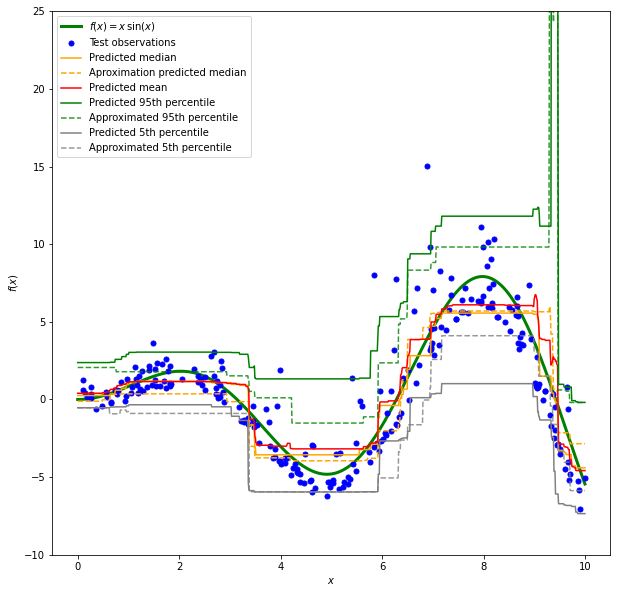

None

.. note:: This tutorial was generated from an IPython notebook that can be
          downloaded `here <../../../source/notebooks/example_usage.ipynb>`_.

.. _example_usage:

Example usage
=============

In this example we are predicting the 5th and 95th percentile and median
of a toy dataset with a Random Forest Quantile Regressor, and the
approximation regressor and comparing it to a general Random Forest
Regressor.

.. code:: python

    import numpy as np
    from sklearn.ensemble import RandomForestRegressor
    from sklearn.model_selection import train_test_split
    import matplotlib.pyplot as plt
    from sklearn_quantile import (
        RandomForestQuantileRegressor,
        SampleRandomForestQuantileRegressor,
    )

The base function ‘generating’ the observations

.. code:: python

    def f(x):
        """The function to predict."""
        return x * np.sin(x)

Observations data are generated

.. code:: python

    rng = np.random.RandomState(42)
    X = np.atleast_2d(rng.uniform(0, 10.0, size=1000)).T
    expected_y = f(X).ravel()
    
    sigma = 0.5 + X.ravel() / 10
    noise = rng.lognormal(sigma=sigma) - np.exp(sigma ** 2 / 2)
    y = expected_y + noise
    
    X_train, X_test, y_train, y_test = train_test_split(X, y, random_state=0)

Models are initaliased, with the same common parameters to make the
estimates comparable

.. code:: python

    common_params = dict(
        max_depth=3,
        min_samples_leaf=4,
        min_samples_split=4,
    )
    qrf = RandomForestQuantileRegressor(**common_params, q=[0.05, 0.5, 0.95])
    qrf.fit(X_train, y_train)
    
    sqrf = SampleRandomForestQuantileRegressor(**common_params, q=[0.05, 0.5, 0.95])
    sqrf.fit(X_train, y_train)
    
    rf = RandomForestRegressor(**common_params)
    rf.fit(X_train, y_train)

.. parsed-literal::

    RandomForestRegressor(max_depth=3, min_samples_leaf=4, min_samples_split=4)

Prediction are done all at once. The quantile models return the
different quantiles on the first axes if more than one is given
(i.e. shape=(n_quantiles, n_samples)). Afterwards they are splitted for
plotting purposes.

.. code:: python

    xx = np.atleast_2d(np.linspace(0, 10, 1000)).T
    
    predictions = qrf.predict(xx)
    s_predictions = sqrf.predict(xx)
    
    y_pred = rf.predict(xx)
    
    y_lower = predictions[0]
    y_med = predictions[1]
    y_upper = predictions[2]
    
    y_s_lower = s_predictions[0]
    y_s_med = s_predictions[1]
    y_s_upper = s_predictions[2]

Plotting the results:

.. code:: python

    fig = plt.figure(figsize=(10, 10))
    plt.plot(xx, f(xx), 'g', linewidth=3, label=r'$f(x) = x\,\sin(x)$')
    plt.plot(X_test, y_test, 'b.', markersize=10, label='Test observations')
    
    plt.plot(xx, y_med, 'r-', label='Predicted median', color="orange")
    plt.plot(xx, y_s_med, 'r-', label='Aproximation predicted median', color="orange", linestyle="--")
    plt.plot(xx, y_pred, 'r-', label='Predicted mean')
    
    plt.plot(xx, y_upper, 'g', label='Predicted 95th percentile')
    plt.plot(xx, y_s_upper, 'g--', alpha=0.8, label='Approximated 95th percentile')
    plt.plot(xx, y_lower, 'grey', label='Predicted 5th percentile')
    plt.plot(xx, y_s_lower, 'grey', linestyle='--', alpha=0.8, label='Approximated 5th percentile')
    
    plt.xlabel('$x$')
    plt.ylabel('$f(x)$')
    plt.ylim(-10, 25)
    plt.legend(loc='upper left')
    plt.savefig("example.png", dpi=300, bbox_inches='tight')
    plt.show()

.. parsed-literal::

    /var/folders/dl/b3rz1nb55sqgldl8hnzqvz0m0000gn/T/ipykernel_48005/2061403229.py:5: UserWarning: color is redundantly defined by the 'color' keyword argument and the fmt string "r-" (-> color='r'). The keyword argument will take precedence.
      plt.plot(xx, y_med, 'r-', label='Predicted median', color="orange")
    /var/folders/dl/b3rz1nb55sqgldl8hnzqvz0m0000gn/T/ipykernel_48005/2061403229.py:6: UserWarning: linestyle is redundantly defined by the 'linestyle' keyword argument and the fmt string "r-" (-> linestyle='-'). The keyword argument will take precedence.
      plt.plot(xx, y_s_med, 'r-', label='Aproximation predicted median', color="orange", linestyle="--")
    /var/folders/dl/b3rz1nb55sqgldl8hnzqvz0m0000gn/T/ipykernel_48005/2061403229.py:6: UserWarning: color is redundantly defined by the 'color' keyword argument and the fmt string "r-" (-> color='r'). The keyword argument will take precedence.
      plt.plot(xx, y_s_med, 'r-', label='Aproximation predicted median', color="orange", linestyle="--")

This shows that the median is very close to the mean, as could be
expected with the normally distributed random noise. The quantiles
indeed following the expected trend (with the sample approximation model
coming very close to the original quantile model), although their
accuracy could be higher. The optimisation process can be seen in the
second example notebook.

Note that although the models are capable of predicting the three
quantilesa at once, the optimal Random Forest parameters are not
necessarily the same. The lower quantiles in this case are much better
behaved than the higher ones. In the second notebook the quantiles are
optimised separately, leading to much higher accuracy.
